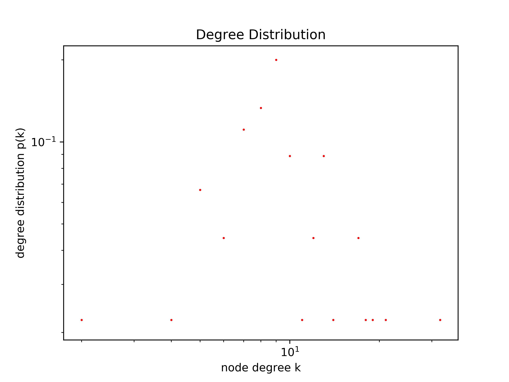

# Graph Analysis
```
$ python3 analysis.py 1_links.txt 1_nicknames.txt
```

> ########### Basic Graph Data ###########
> - Number of nodes: 45
> - Number of edges: 231
> - Given graph is not strongly connected.
> 
> ########### ex01 ###########
> - Shortest path from jacob to andy: ['jacob', 'clayton', 'andy'] , 2 hops



